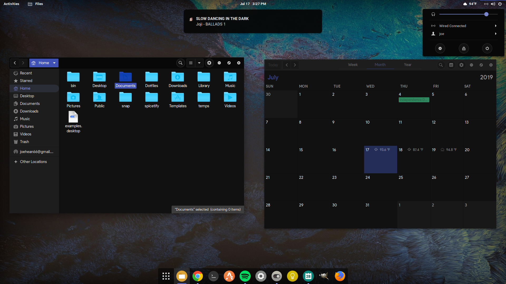
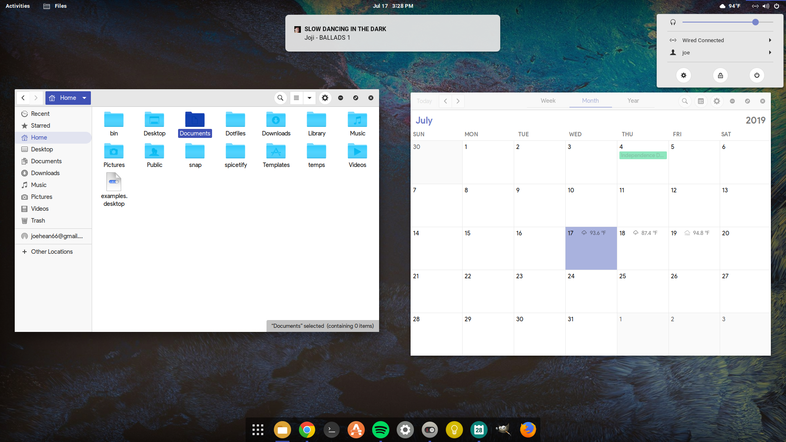

# Dotfiles
Just a collection of dotfiles for my setup

## Extensions/Tools Used
<b> Wallpaper: </b> https://imgur.com/a/FzeY95F Comes from the Abstruct app
  <b> GTK: </b> Plata Noir Compact
  <b> Icons: </b> McMojave Circle, some icons are modified by me personally.
  <b> Dock: </b> Dash to dock
  <b> Shell: </b> Plata Noir
  <b> Visualizer: </b> Glava
  <b> Alt-tab: </b> Coverflow alt-tab
  <b> Transparent top-bar: </b> Dynamic Panel Transparency
  <b> Custom spotify theme: </b> Spicetify-cli
  <b> Weather in top bar: </b> Meteo
